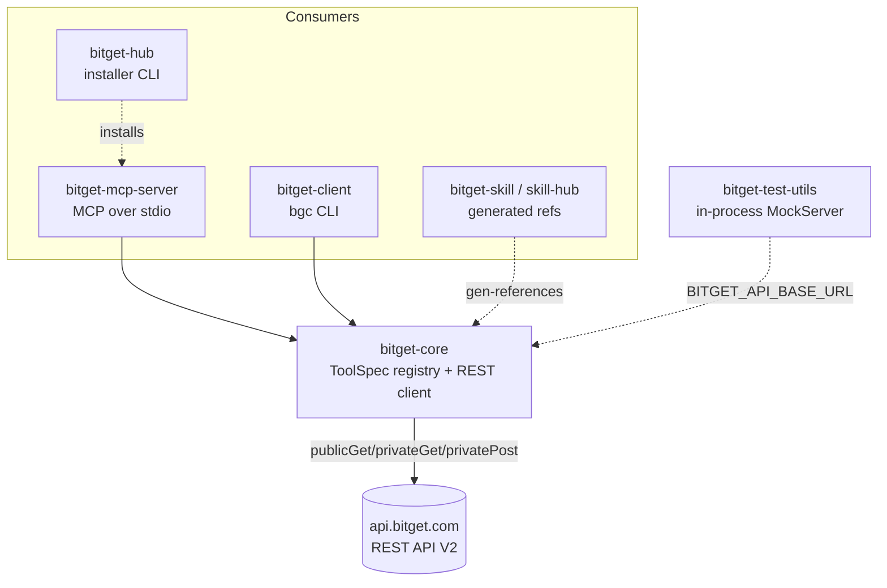
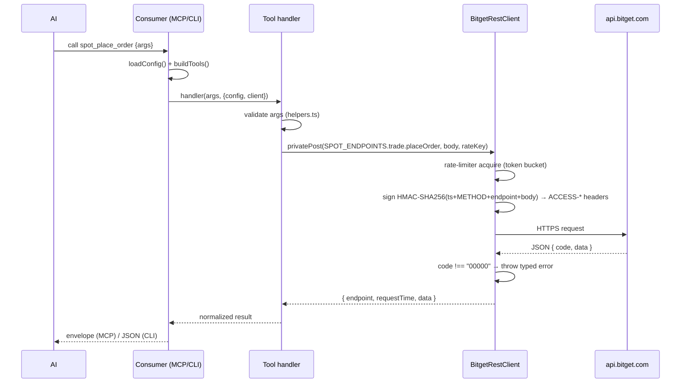

# Architecture

> Reflects the current monorepo. Supersedes the earlier single-package design draft.

## High-level

pnpm monorepo. One shared core library (`bitget-core`) owns all logic; thin consumers re-expose the same tool set to different runtimes. Zero third-party runtime deps in the data path — Node built-ins (`fetch`, `crypto`, `parseArgs`) only; `@modelcontextprotocol/sdk` is used solely by the MCP consumer.



## Service boundaries (packages)

| Package | Role | Entry / bin | Depends on |
|---------|------|-------------|------------|
| `bitget-core` | Tool registry, REST client, auth, rate limit, errors, endpoint constants | `dist/index.js` | — |
| `bitget-mcp-server` | MCP server, maps `ToolSpec`→MCP `Tool`, response envelope | bin `bitget-mcp-server` | `bitget-core` (workspace:*) |
| `bitget-client` | `bgc <module> <tool> --param value` CLI, JSON out | bin `bgc` | `bitget-core` |
| `bitget-test-utils` | HTTP `MockServer` + stateful routes for tests | bin `bitget-mock-server` | — |
| `bitget-skill` / `bitget-skill-hub` | Skill packaging; `references/commands.md` generated | bin `bitget-skill-hub` | `bitget-core` (build-time) |
| `bitget-hub` | Install/upgrade/rollback published packages | bin `bitget-hub` (`cli.mjs`) | — |

**Consumers import `bitget-core`'s built `dist/`, not its source** (`main: dist/index.js`). Build core before building/testing consumers, the smoke test, or `gen-references`.

## bitget-core module responsibilities

```
packages/bitget-core/src/
├── constants.ts        # SERVER_NAME, SERVER_VERSION, MODULES, DEFAULT_MODULES
├── config.ts           # loadConfig(): merge env + CLI, validate, BitgetConfig
├── index.ts            # public exports
├── api/<module>.ts     # endpoint-path constants (<MODULE>_ENDPOINTS); margin uses marginEndpoint()
├── client/
│   ├── rest-client.ts  # BitgetRestClient: publicGet / privateGet / privatePost
│   └── types.ts        # request/response/query types
├── tools/
│   ├── types.ts        # ToolSpec, ModuleId, ToolContext
│   ├── index.ts        # buildTools(config): concat all + filter by module + readOnly
│   ├── helpers.ts      # arg validators (requireString, readNumber, assertEnum, compactObject…)
│   ├── common.ts       # shared rate-limit helpers
│   └── <module>.ts     # register<Module>Tools(): ToolSpec[]
└── utils/
    ├── signature.ts    # HMAC-SHA256 signing
    ├── rate-limiter.ts # token-bucket limiter
    └── errors.ts       # typed errors + Bitget code mapping
```

### ToolSpec — the central abstraction

```ts
interface ToolSpec {
  name: string;        // e.g. 'spot_get_ticker'
  module: ModuleId;    // spot | futures | account | margin | copytrading | convert | earn | p2p | broker
  description: string; // function + auth + rate limit + [CAUTION] for writes
  inputSchema: JsonSchema;
  isWrite: boolean;    // true = mutating
  handler: (args, ctx) => Promise<unknown>;
}
```

`buildTools(config)` = concat every `register*Tools()` → filter to enabled `config.modules` → if `config.readOnly`, drop every `isWrite`. Adding a `ToolSpec` flows automatically into MCP, CLI, capabilities, and generated skill refs.

## Request flow (write order example)



## Data flow / endpoint paths

Endpoint paths are centralized in `api/` (one file per module, e.g. `SPOT_ENDPOINTS.trade.placeOrder`). Handlers reference constants, never hardcode `/api/v2/...`. Margin paths are scoped by margin type via `marginEndpoint(marginType, suffix)` + `MARGIN_ENDPOINTS` suffixes. Path change = one edit in `api/`.

## Security considerations

- **Credentials env-only**: `BITGET_API_KEY`, `BITGET_SECRET_KEY`, `BITGET_PASSPHRASE`. Partial credentials throw. Never written to disk or logs.
- **Signing**: `base64(HMAC-SHA256(timestamp + METHOD + requestPath + body, secretKey))` in `ACCESS-SIGN`/`ACCESS-*` headers (`utils/signature.ts`).
- **Write gating**: `--read-only` removes mutating tools entirely (defense in depth, not just hints). MCP marks writes with `destructiveHint`, reads with `readOnlyHint`.
- **Demo isolation**: `--paper-trading` sets `paptrading: 1`; same code path, Demo credentials.
- No server-side amount caps / allowlists / 2FA gate — writes are irreversible; callers must confirm.

## Error handling

Bitget responses with `code !== "00000"` throw typed errors (`errors.ts`). Auth codes `40017/40018/40036` → `AuthenticationError`. Categories: `ConfigError`, `AuthenticationError`, `RateLimitError`, `ValidationError`, `BitgetApiError`, `NetworkError`. MCP wraps results in `{ tool, ok, data|error, capabilities, timestamp }`.

## Rate limiting

Client-side token bucket (`utils/rate-limiter.ts`), per-endpoint keys, to stop AI loops from breaching Bitget limits before requests leave the process.

## Earn capability probing

`earn` may be unsupported per account/region. Server lazily probes (`warmupEarnCapability`, `getEarnCapabilityStatus`) and hides earn tools from `list_tools` when `unsupported`. `endpointCandidates()` tries candidate paths and caches the first that isn't a 404.

## Testing architecture

vitest against an in-process mock of Bitget REST: `bitget-test-utils` `MockServer` starts an HTTP server; tests point `BITGET_API_BASE_URL` at it. Routes in `src/server/routes/<module>.ts`, stateful behavior in `state.ts` (place-order→get-orders round-trips). Mock asserts exact `/api/v2/...` routes — a wrong endpoint constant fails a test. New endpoint ⇒ add a matching mock route.

## Build & scaling

- `tsup` per package (ESM + DTS), shared `tsconfig.base.json`, strict TS + `noUncheckedIndexedAccess`, ESM + NodeNext (`.js` import extensions in `.ts`).
- Stateless request path → horizontally trivial; the only shared state is the in-process rate limiter and the earn-capability cache (per process).
- `scripts/mcp-smoke-test.mjs` spawns the built server and calls real tools; `scripts/publish.mjs` publishes in dependency order (`--publish`, else dry-run).
